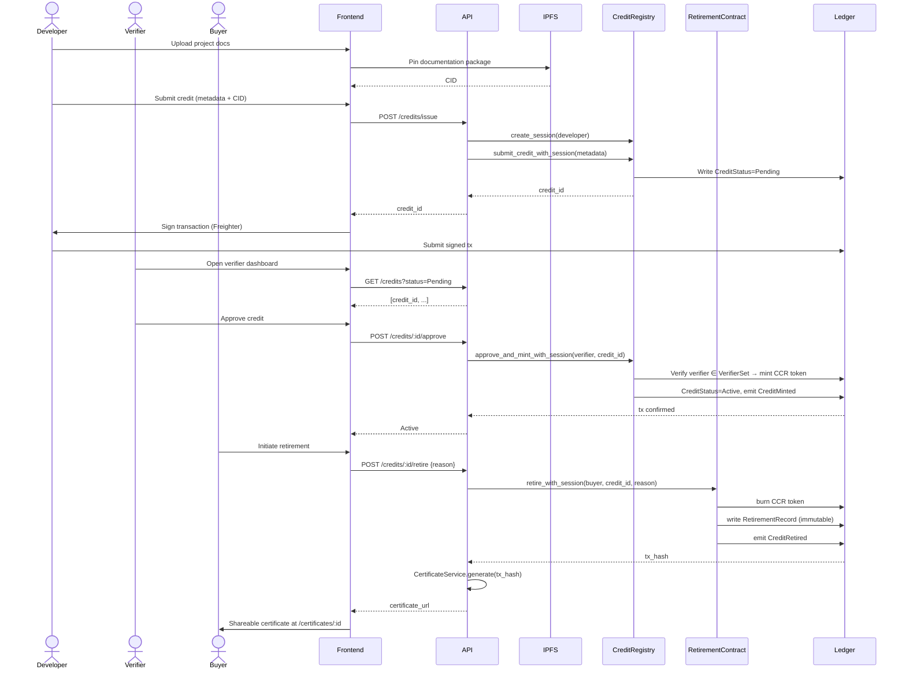
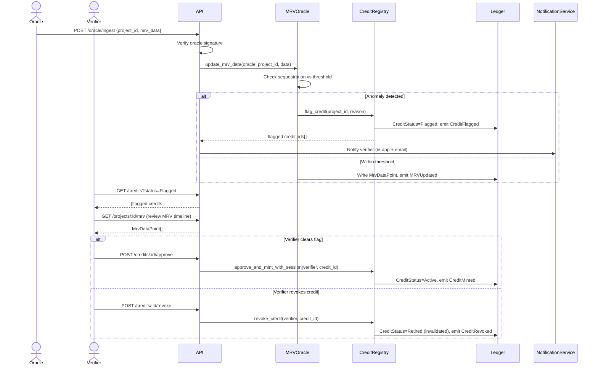
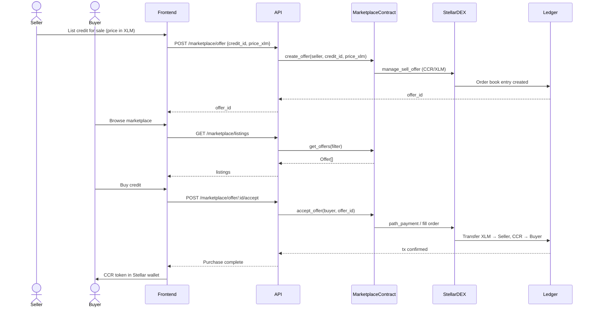

# CarbonChain — Architecture

This document describes the full technical architecture of CarbonChain: component responsibilities, data flows, contract design, new API methods, and key design decisions.

---

## Table of Contents

- [System Overview](#system-overview)
- [Architecture](#architecture)
- [Layer 1 — Soroban Smart Contracts](#layer-1--soroban-smart-contracts)
- [Layer 2 — NestJS API](#layer-2--nestjs-api)
- [Layer 3 — Angular Frontend](#layer-3--angular-frontend)
- [Layer 4 — Stellar Primitives](#layer-4--stellar-primitives)
- [Layer 5 — Off-chain Storage](#layer-5--off-chain-storage)
- [Data Flows](#data-flows)
- [New API Methods](#new-api-methods)
- [New Data Structures](#new-data-structures)
- [New Events](#new-events)
- [Authentication & Authorization](#authentication--authorization)
- [Key Design Decisions](#key-design-decisions)
- [Security](#security)
- [Performance](#performance)
- [Scalability & Future Work](#scalability--future-work)

---

## System Overview

CarbonChain is a five-layer system built on the Stellar public network. The core architectural principle is **minimal trust** — the Stellar ledger and Soroban contracts hold authoritative state. The NestJS API and Angular frontend are convenience layers; they cannot lie about what the ledger says.

```
┌──────────────────────────────────────────────────────────────────┐
│                  Angular Frontend (SPA)                          │
│       Marketplace · Portfolio · Retirement Flow · Admin          │
└─────────────────────────┬────────────────────────────────────────┘
                          │ HTTP / REST + JWT
┌─────────────────────────▼────────────────────────────────────────┐
│                  NestJS API (REST)                                │
│    Credits · Projects · Retirement · Marketplace · Oracle        │
└─────────────────────────▼────────────────────────────────────────┐
                          │ Stellar JS SDK + Soroban RPC
┌─────────────────────────▼────────────────────────────────────────┐
│              Soroban Smart Contracts (Rust / WASM)               │
│   CreditRegistry · Retirement · Marketplace · MRV Oracle         │
└─────────────────────────┬────────────────────────────────────────┘
                          │
┌─────────────────────────▼────────────────────────────────────────┐
│                 Stellar Public Ledger                             │
│     Custom Assets · DEX · Claimable Balances · Multi-sig         │
└──────────────────────────────────────────────────────────────────┘

Off-chain:  PostgreSQL (read index)  ·  IPFS/Filecoin (docs)  ·  IoT/Satellite (MRV)
```

---

## Architecture

Each layer has a clearly defined responsibility and a single direction of trust:

| Layer | Technology | Responsibility |
|---|---|---|
| Smart contracts | Rust + Soroban | Authoritative credit state, mint/burn logic, verifier enforcement |
| API | NestJS | Transaction building, IPFS uploads, read-model sync, JWT issuance |
| Frontend | Angular 17+ | UI, wallet signing, Freighter integration |
| Stellar primitives | Stellar protocol | Asset issuance, DEX, claimable balances, multi-sig |
| Off-chain storage | PostgreSQL + IPFS | Fast reads, project documentation |

---

## Layer 1 — Soroban Smart Contracts

All contracts are written in Rust and compiled to WebAssembly for Soroban. Each contract follows the same internal module structure:

```
contracts/<name>/src/
├── lib.rs        # Contract entry points and function signatures
├── storage.rs    # Persistent data management (instance + persistent storage)
├── events.rs     # Event definitions and publishing
├── types.rs      # Data structures and enums
└── errors.rs     # Stable error codes (see Error Codes below)
```

### CreditRegistry Contract

**Responsibility:** Authoritative record of all carbon credits. Controls minting and enforces verifier approval.

**Storage schema:**

```rust
enum DataKey {
    Credit(BytesN<32>),   // credit_id → CreditMetadata
    VerifierSet,          // Set<Address> of approved verifiers
    AdminAddress,         // Platform admin
    SessionCounter,       // Auto-incrementing session ID
    AuditLog(u64),        // Sequential audit entries
}

struct CreditMetadata {
    project_id:   String,
    issuer:       Address,
    vintage_year: u32,
    methodology:  String,
    geography:    String,   // ISO country code
    tonnes:       i128,     // kg precision (1 tonne = 1_000_000)
    ipfs_hash:    String,   // IPFS CID of documentation package
    status:       CreditStatus,
    issued_at:    u64,
}

enum CreditStatus {
    Pending,   // Awaiting verifier co-sig
    Active,    // Minted, tradeable
    Retired,   // Permanently burned
    Flagged,   // MRV anomaly, under review
}
```

**Key functions:**

```rust
fn initialize(env: Env, admin: Address)
fn submit_credit(env: Env, issuer: Address, metadata: CreditMetadata) -> BytesN<32>
fn approve_and_mint(env: Env, verifier: Address, credit_id: BytesN<32>)
fn add_verifier(env: Env, admin: Address, verifier: Address)
fn remove_verifier(env: Env, admin: Address, verifier: Address)
fn get_credit(env: Env, credit_id: BytesN<32>) -> CreditMetadata
fn list_credits_by_project(env: Env, project_id: String) -> Vec<BytesN<32>>
```

**Multi-sig enforcement:** `approve_and_mint` calls `verifier.require_auth()` and checks `VerifierSet` membership before minting. The CCR token is minted via a Soroban token contract call — the CreditRegistry is the token admin authority.

---

### Retirement Contract

**Responsibility:** Burns a CCR token and writes a permanent, immutable retirement record. No delete function exists.

**Storage schema:**

```rust
struct RetirementRecord {
    credit_id:      BytesN<32>,
    buyer:          Address,
    tonnes_retired: i128,
    reason:         String,
    retired_at:     u64,
    tx_hash:        BytesN<32>,
}
```

**Key functions:**

```rust
fn retire(env: Env, buyer: Address, credit_id: BytesN<32>, reason: String) -> BytesN<32>
fn get_retirement(env: Env, retirement_id: BytesN<32>) -> RetirementRecord
fn list_retirements_by_address(env: Env, address: Address) -> Vec<BytesN<32>>
```

**Burn mechanism:** `retire()` calls `buyer.require_auth()`, invokes the CCR token contract's `burn()`, writes the `RetirementRecord` to persistent storage, and emits a `CreditRetired` event.

---

### Marketplace Contract

**Responsibility:** Manages on-chain offer listings. Integrates with Stellar's native DEX.

**Key functions:**

```rust
fn create_offer(env: Env, seller: Address, credit_id: BytesN<32>, price_xlm: i128)
fn cancel_offer(env: Env, seller: Address, offer_id: BytesN<32>)
fn accept_offer(env: Env, buyer: Address, offer_id: BytesN<32>)
fn get_offers(env: Env, filter: OfferFilter) -> Vec<Offer>
```

For liquid price discovery, the contract places `manage_sell_offer` operations on Stellar's built-in DEX — CCR tokens are natively tradeable against XLM, USDC, or any other Stellar asset without a custom order book.

---

### MRV Oracle Contract

**Responsibility:** Accepts authenticated data updates from trusted oracles. Flags credits for re-verification on anomaly detection.

**Key functions:**

```rust
fn register_oracle(env: Env, admin: Address, oracle: Address)
fn update_mrv_data(env: Env, oracle: Address, project_id: String, data: MrvDataPoint)
fn flag_project(env: Env, oracle: Address, project_id: String, reason: String)
fn get_latest_mrv(env: Env, project_id: String) -> MrvDataPoint
```

A registered oracle calls `oracle.require_auth()`. If reported sequestration deviates beyond the configured threshold, the contract calls `CreditRegistry::flag_credit()` automatically.

---

### Error Codes

All contracts use stable numeric error codes for API compatibility across upgrades:

| Range | Contract |
|---|---|
| 100–109 | `credit_registry` |
| 110–114 | `retirement` |
| 115–118 | `marketplace` |
| 119–120 | `mrv_oracle` |

See `docs/features/ERROR_CODES_REFERENCE.md` for the full reference.

---

## Layer 2 — NestJS API

The API is a NestJS application with standard module architecture. It is **stateless with respect to credit data** — credit state is read from the Stellar ledger via Horizon and Soroban RPC. PostgreSQL is used only for off-chain indexing.

### Module structure

```
api/src/
├── app.module.ts
├── stellar/
│   ├── stellar.service.ts          # Horizon + Soroban RPC client
│   └── stellar-keypair.service.ts  # Admin key management
├── credits/
│   ├── credits.controller.ts       # GET /credits, GET /credits/:id
│   ├── credits.service.ts          # Calls CreditRegistry contract
│   └── dto/
├── projects/
│   ├── projects.controller.ts      # POST /projects
│   ├── projects.service.ts
│   └── ipfs.service.ts             # Pinata / IPFS integration
├── retirement/
│   ├── retirement.controller.ts    # POST /credits/:id/retire
│   ├── retirement.service.ts       # Builds + submits retirement tx
│   └── certificate.service.ts     # PDF certificate generation
├── marketplace/
│   ├── marketplace.controller.ts
│   └── marketplace.service.ts      # DEX order book + contract offers
├── verifiers/
│   ├── verifiers.controller.ts
│   └── verifiers.service.ts
├── oracle/
│   ├── oracle.controller.ts        # Webhook for MRV data ingestion
│   └── oracle.service.ts
└── auth/
    ├── auth.controller.ts          # POST /auth/challenge, /auth/verify
    └── stellar-auth.strategy.ts    # Freighter signature verification (SEP-10)
```

### StellarService

`StellarService` is the core dependency injected across all feature modules:

```typescript
@Injectable()
export class StellarService {
  async invokeContract(
    contractId: string,
    method: string,
    args: xdr.ScVal[],
    signerKeypair: Keypair,
  ): Promise<SorobanRpc.GetTransactionResponse>

  async buildAndSubmit(
    operations: Operation[],
    signerKeypair: Keypair,
  ): Promise<Horizon.SubmitTransactionResponse>

  async getContractData(
    contractId: string,
    key: xdr.ScVal,
  ): Promise<xdr.ScVal>

  async simulateTransaction(
    tx: Transaction,
  ): Promise<SorobanRpc.SimulateTransactionResponse>
}
```

Every transaction is simulated via `simulateTransaction` before submission to catch contract panics and compute accurate resource fees.

---

## Layer 3 — Angular Frontend

The Angular frontend is a single-page application using standalone components (Angular 17+), Angular Signals for reactive state, and the Angular Router for navigation.

### Module breakdown

```
frontend/src/app/
├── core/
│   ├── services/
│   │   ├── auth.service.ts              # JWT + Freighter wallet state
│   │   ├── stellar-wallet.service.ts    # Freighter API wrapper
│   │   └── api.service.ts              # Typed HTTP client
│   └── interceptors/
│       └── auth.interceptor.ts          # Injects JWT on all API calls
├── shared/
│   ├── components/                      # Buttons, cards, credit badges
│   └── pipes/                           # tonnes formatter, XLM formatter
├── dashboard/                           # Portfolio: credits + retirement history
├── marketplace/                         # Browse, filter, and buy credits
├── projects/                            # Project detail + MRV data timeline
├── retire/                              # 3-step retirement wizard
├── certificates/                        # Shareable retirement certificate page
└── admin/
    ├── verifier-queue.component.ts      # Review pending credit submissions
    └── oracle-dashboard.component.ts    # MRV oracle feed monitoring
```

### State management

The app uses **Angular Signals** for reactive local state and **RxJS** for async API streams. A lightweight `CreditStore` signal service handles the small amount of shared global state:

```typescript
@Injectable({ providedIn: 'root' })
export class CreditStore {
  private _ownedCredits = signal<Credit[]>([]);
  readonly ownedCredits = this._ownedCredits.asReadonly();

  readonly totalTonnes = computed(() =>
    this._ownedCredits().reduce((sum, c) => sum + c.tonnes, 0)
  );
}
```

### Freighter wallet integration

```typescript
@Injectable({ providedIn: 'root' })
export class StellarWalletService {
  async connect(): Promise<string>                     // Returns public key
  async signTransaction(xdr: string): Promise<string> // Returns signed XDR
  async getNetwork(): Promise<string>                  // Validates network match
}
```

---

## Layer 4 — Stellar Primitives

CarbonChain uses Stellar's native protocol features rather than re-implementing them in contract logic:

| Primitive | How CarbonChain uses it |
|---|---|
| **Custom assets** | CCR token (1 token = 1 tonne CO₂e). Issued by CreditRegistry as the token admin. Works in any Stellar wallet natively. |
| **Stellar DEX** | CCR tokens listed on the built-in order book via `manage_sell_offer`. Tradeable against XLM, USDC, or any asset. |
| **Claimable balances** | Lock credits during verifier approval window. Issuer creates balance; verifier claims it to trigger mint. |
| **Multi-sig** | Verifier accounts are co-signers on the CCR issuer account. Mint requires issuer + at least one registered verifier. |
| **Memo field** | Retirement transactions include credit ID in memo for Horizon event stream lookup. |

---

## Layer 5 — Off-chain Storage

### PostgreSQL (read model)

Stores a read-optimized index of on-chain state, synced by a Soroban event listener in the NestJS API. Never the source of truth — on conflict, the ledger wins.

```sql
credits        -- Indexed copy of CreditMetadata from contract events
retirements    -- Indexed copy of RetirementRecord from contract events
projects       -- Extended project profiles (name, description, logo URL)
users          -- Public key → display name, notification preferences
mrv_readings   -- Time-series MRV data per project
sessions       -- Audit session records
audit_log      -- Operation-level audit entries
```

### IPFS / Filecoin

Project documentation packages (methodology reports, satellite imagery, audit PDFs) are uploaded via Pinata. The resulting CID is stored in `CreditMetadata.ipfs_hash` on-chain, so anyone can independently verify documentation matches what was submitted.

---

## Data Flows

### Credit issuance flow

```
1.  Developer uploads docs → IPFS → receives CID
2.  Developer calls POST /projects and POST /credits/issue with CID
3.  API creates an audit session: create_session(developerAddress)
4.  API builds Soroban tx calling CreditRegistry::submit_credit_with_session()
5.  Developer signs tx with Freighter → CreditStatus = Pending
6.  Verifier sees pending credit in verifier dashboard
7.  Verifier calls approve_and_mint_with_session() with their signature
8.  Contract verifies verifier ∈ VerifierSet → mints CCR token
9.  CreditStatus → Active, CCR appears in developer's Stellar wallet
10. Horizon event listener syncs credit to PostgreSQL read model
```

#### Sequence diagram — happy-path credit lifecycle (submit → approve → retire)



### Retirement flow

```
1.  Buyer holds CCR tokens in their Stellar wallet
2.  Buyer initiates retirement in UI with a reason string
3.  Frontend builds Soroban tx calling Retirement::retire_with_session()
4.  Buyer signs with Freighter (authorizing the on-chain burn)
5.  API submits → contract burns token, writes immutable RetirementRecord
6.  CertificateService generates PDF with ledger tx hash embedded
7.  Buyer receives a shareable certificate URL at /certificates/:id
```

### MRV data flow

```
1.  IoT sensor or satellite API sends signed webhook to POST /oracle/ingest
2.  OracleService verifies oracle signature, builds Soroban tx
3.  MRV Oracle contract receives MrvDataPoint, checks against threshold
4.  If anomaly detected → contract calls CreditRegistry::flag_credit()
5.  CreditStatus → Flagged, verifier notified via in-app + email
```

#### Sequence diagram — flagged credit re-review flow (submit → flag → re-review)



#### Sequence diagram — marketplace buy flow



---

## New API Methods

### Session Management

| Method | Description |
|---|---|
| `create_session(initiator)` | Create new audit session, returns session ID |
| `get_session(session_id)` | Retrieve session with full metadata |
| `get_session_operation_count(session_id)` | Count operations logged in session |
| `get_audit_log(log_id)` | Retrieve a specific audit log entry by sequential ID |

### Session-Aware Operations

| Method | Description |
|---|---|
| `submit_credit_with_session(...)` | Submit credit issuance with full audit logging |
| `approve_and_mint_with_session(...)` | Verifier approval with audit logging |
| `retire_with_session(...)` | Credit retirement with audit logging |
| `register_verifier_with_session(...)` | Register verifier with audit logging |
| `revoke_verifier_with_session(...)` | Revoke verifier with audit logging |

---

## New Data Structures

```typescript
interface InteractionSession {
  session_id:     string;
  initiator:      string;   // Stellar public key
  created_at:     number;   // ledger timestamp
  operation_count: number;
  status:         'active' | 'completed';
}

interface OperationContext {
  session_id:  string;
  operation:   string;
  actor:       string;
  target_id:   string;
  result:      'success' | 'failure';
  timestamp:   number;
  metadata:    Record<string, string>;
}

interface AuditLog {
  log_id:    number;           // sequential, immutable
  context:   OperationContext;
  tx_hash:   string;
}
```

---

## New Events

| Event | Emitted when |
|---|---|
| `SessionCreated` | A new audit session is opened |
| `OperationLogged` | Any session-aware operation completes |
| `CreditSubmitted` | A new credit is submitted for approval |
| `CreditMinted` | Verifier approves and CCR token is minted |
| `CreditRetired` | Token is burned and retirement record written |
| `CreditFlagged` | MRV oracle detects anomaly |
| `VerifierRegistered` | New verifier added to VerifierSet |
| `VerifierRevoked` | Verifier removed from VerifierSet |

---

## Authentication & Authorization

CarbonChain uses **Stellar wallet-based authentication** (SEP-10 challenge-response with Freighter) rather than passwords.

**Auth flow:**

```
1. Client: POST /auth/challenge { publicKey }
2. API: Returns a signed Stellar tx with nonce in memo field (SEP-10)
3. Client: Signs with Freighter → POST /auth/verify { signedXdr }
4. API: Verifies signature → issues JWT { publicKey, roles[] }
5. All subsequent API calls: Authorization: Bearer <jwt>
```

**Role model:**

| Role | How granted | Capabilities |
|---|---|---|
| Anonymous | — | View marketplace, verify certificates |
| User | Freighter sign-in | Buy, retire, view portfolio |
| Issuer | Admin flag | Submit credit issuance requests |
| Verifier | Added to VerifierSet in contract | Approve submissions, trigger mints |
| Admin | Platform admin keypair | Add/remove verifiers, contract upgrades |

JWT claims are enforced by NestJS `RolesGuard`. Contract operations additionally require the actual Stellar signature — a compromised JWT cannot forge on-chain actions.

---

## Key Design Decisions

**Why Stellar over Ethereum?**
Native asset primitives mean CCR tokens work in any Stellar wallet without ERC-20 approval flows. The built-in DEX eliminates a custom AMM. Fees are ~$0.00001/tx, making fractional credits (0.1 tonne) economically viable.

**Why NestJS over Express?**
NestJS's decorator-based module system maps cleanly to the domain model. Dependency injection makes `StellarService` trivially mockable in tests. TypeScript-first throughout matches the shared types package.

**Why Angular over React?**
Angular's strong typing, built-in DI, and opinionated structure suit a long-lived financial application. Signals (Angular 17+) provide fine-grained reactivity without NgRx overhead for this scope.

**Why not store everything on-chain?**
Project descriptions and MRV time-series would bloat contract storage. IPFS provides content-addressed storage (tamper-evident via CID) while keeping on-chain state lean. PostgreSQL provides fast, filterable queries over the indexed state.

**Why claimable balances for the approval window?**
Using a claimable balance escrows the developer's tokens until verifier approval. No risk of premature transfer. It is a native Stellar primitive with no additional contract logic.

**Why session-based audit?**
Regulatory frameworks (EU ETS, CORSIA) increasingly require full chain-of-custody records. Session-based logging satisfies this without impacting the performance of the core credit lifecycle operations.

---

## Security

- No private keys in the API — all user-facing transactions signed client-side via Freighter
- Stable error codes (100–120) across contract upgrades for API compatibility
- Replay protection at multiple contract levels via nonce-based verification
- Immutable audit logs — no delete functions on retirements or sessions
- Authorization checks on all state-mutating contract functions
- Simulation before submission — every tx simulated via `soroban_simulateTransaction`
- Contract upgradability is time-locked — upgrades require admin keypair and emit upgrade events
- `.claudeignore` excludes `ADMIN_SECRET_KEY` and all credentials from Claude Code context

---

## Performance

- Efficient contract storage with TTL management for transient data
- Minimal event payloads — only IDs and hashes, no full structs in events
- Sequential audit log IDs (no hash lookups on reads)
- PostgreSQL read model offloads complex filter queries from on-chain state
- `simulateTransaction` called before every submission — prevents failed tx fees
- Optimized for Soroban resource constraints (CPU instructions, memory, ledger entries)

---

## Scalability & Future Work

- **Fractional credits** — `i128` tonne storage (in kg) supports 0.1 tonne trading with no contract changes
- **Multi-standard support** — `methodology` is a freeform string; adding new standards is a UI + verifier config change only
- **Cross-chain bridges** — Soroban supports cross-contract calls; a future bridge contract could accept CarbonChain retirement receipts as proof-of-offset for EVM chains
- **DAO governance** — `VerifierSet` and admin functions are candidates for migration to a governance token model
- **Real-time MRV** — Oracle contract interface accepts any authenticated address; connecting Chainlink or a custom IoT gateway requires only oracle address registration
- **Batch retirement** — `retire_batch()` function planned for corporate buyers retiring thousands of credits per reporting cycle

---

## Repository

```bash
git clone git@github.com:legend-esc/carbonchain.git
```

---

*Last updated: 2026 · CarbonChain is open source under the MIT License*
